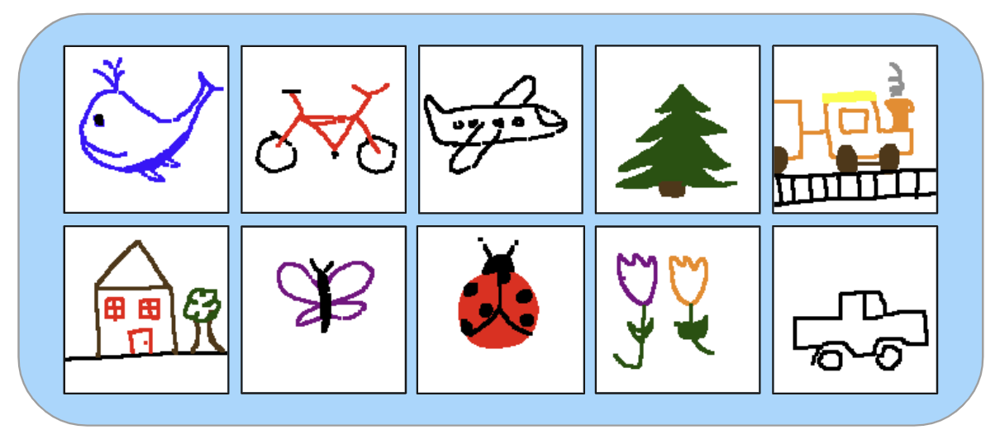

# AI Pictionary

Welcome to my AI Pictionary Game, an interactive web application designed to demystify the inner workings of machine learning through a fun and engaging drawing game. This project combines the simplicity of Pictionary with the complexities of neural networks, to create a unique educational tool for both ML enthusiasts and the general public.

**---->>> [Try it out here!](https://pictionary-ai.azurewebsites.net/) <<<----**

<p align="center">
    
</p>

## Project Overview

In this game, users draw objects from the 10 classes, and the AI attempts to guess the sketches as quickly as possible. The model is a ResNet-18, selected for its balance of performance and speed, making it suitable for real-time applications. This model has been trained on a diverse set of sketches collected from numerous contributors, spanning 10 classes. These sketches are all stored in the GitHub repository within the data/ directory.

## To Run Locally

The run the application locally, follow these steps:
1. Clone the repository to your local machine.
2. Navigate to the `pictionary-app` directory.
3. Create a virtual python environment using `python -m venv venv`.
4. Activate the virtual environment using `source venv/bin/activate` for mac/linux or `venv\Scripts\activate` for windows.
5. Install the project requirements using `pip install -r requirements.txt`.
6. Run the application from the `pictionary-app` directory using `python app.py`.


## Repository Structure

```
├── .devcontainer
├── .github
├── data
├── img
├── saved_models
├── src
│   ├── data-collection-app
│   ├── model
│   ├── pictionary-app
├── tests
├── .gitignore
├── Makefile
├── README.md
├── requirements.txt
├── setup.sh
```